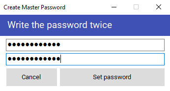
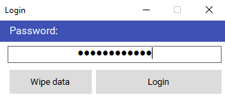
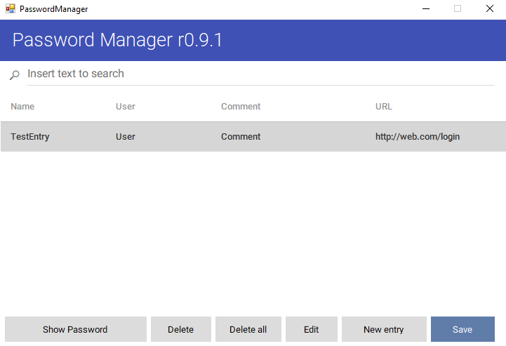

# PasswordManager
Password Manager Project.

Credit for MaterialSkin to: https://github.com/IgnaceMaes/MaterialSkin

Password manager based on SHA3 and AES256 encryption. 

Uses SHA3512 to hash the master password, on every instance the program generates a random IV and Salt at runtime and derives a 256bit key from the plain master password using RFC2898, this data is then used to encrypt the actual passwords and other info into a single file, using AES256.

Other information besides the password can be stored such as metadata on the password entry for user-friendlier use and the capacity to edit this data and generate random secure passwords of a desired length.

The information on every entry amounts to:

````
string Name;
string Username;
string Comment;
string Url;
string Password;
````


UI Images:








